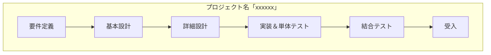

| フェーズ | 概要 |
| --- | --- |
| 要件定義 | 要件を視覚的に表現し、プロジェクトの方針や開発手法、実現方法についてドキュメントとして作成することで明確にする。|
| 基本設計 | 提示いただいた画面を基にI/O情報やDB設計、画面遷移等UIの観点で設計を実施し、ドキュメントを作成することで明確にする。|
| 詳細設計 | 基本設計よりロジカルな観点で設計を行い、作成する詳細設計書からプログラムを起こすことのできる状態まで明確にする。|
| 実装＆単体テスト | 基本設計・詳細設計フェーズにて作成したドキュメントを基に実際にコーディングを実施。実装完了後に機能毎に単体テストを実施し、品質の向上を目指す。|
| 結合テスト | シナリオを作成し、ユースケース単位で一連のテストを実施し、品質の向上を目指す。|
| 受入 | システムの受け入れテストを行う。 |
