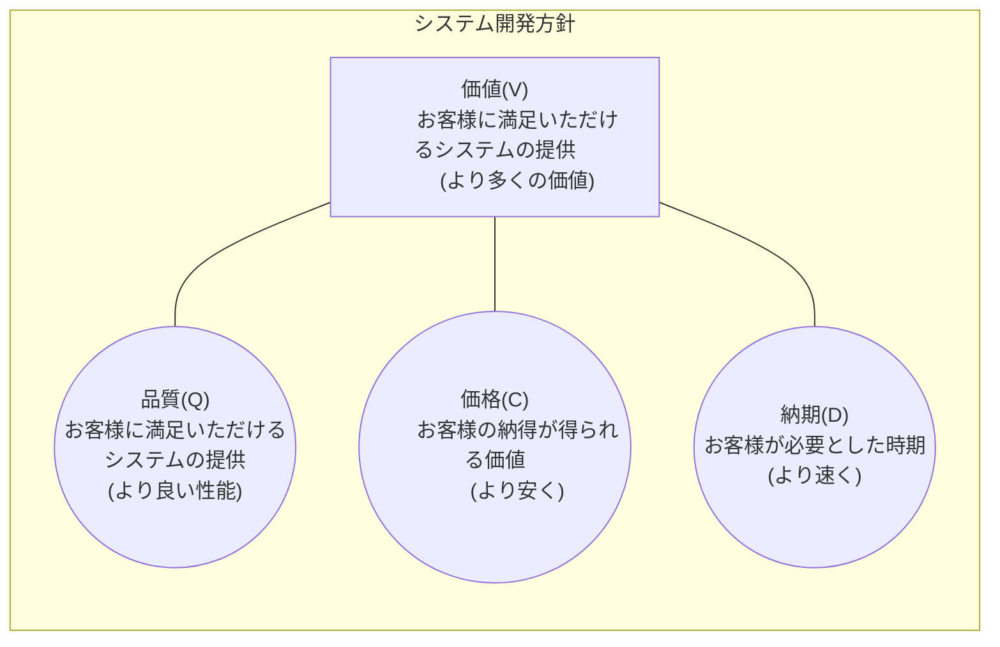

```mermaid
graph LR
    subgraph システム開発方針
        A["価値(V)
        お客様に満足いただけるシステムの提供
        (より多くの価値)"]

        B(("品質(Q)
        お客様に満足いただける
        システムの提供
        (より良い性能)"))

        C(("価格(C)
        お客様の納得が得られる価値
        (より安く)"))

        D(("納期(D)
        お客様が必要とした時期
        (より速く)"))

        A---B
        A---C
        A---D
    end
```

| QCD | 取り組み |
| --- | --- |
| 品質(Q) | 負荷テストの実施|
| 価格(C) | 脆弱性診断(OWASP ZAP)、自動テスト(Autify)の導入|
| 納期(D) | 生成AI(copilot)、ローコード、内製基盤の使用|
